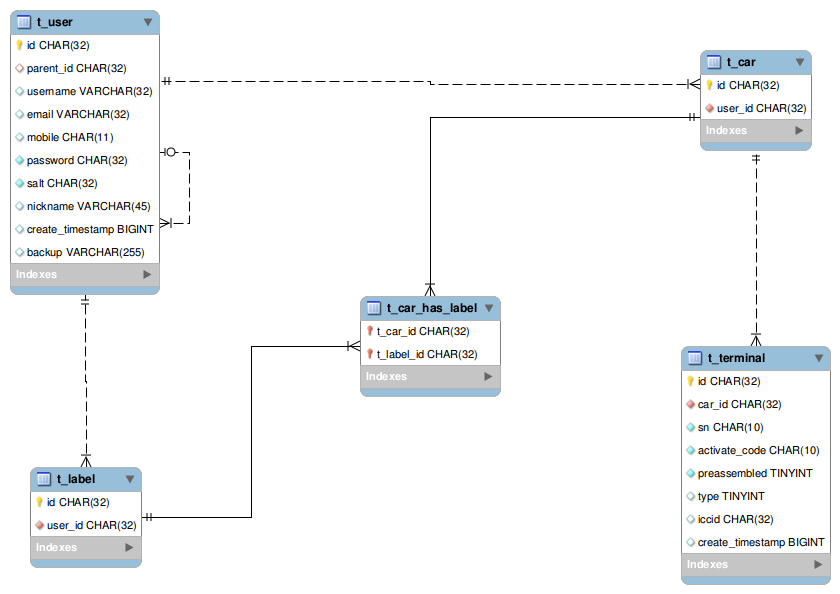
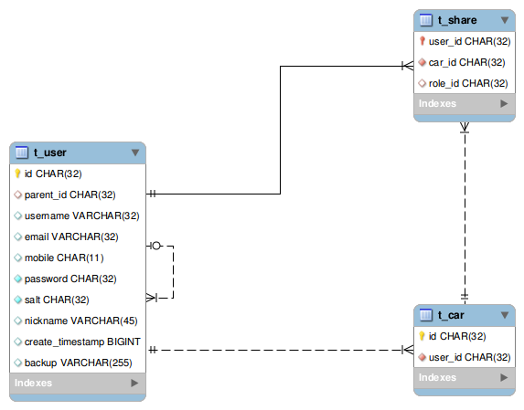

# 领域模型设计

## 目标

* 描述整体的业务模型，由需求导出模型，再由模型规范需求

* 满足当前需求的前提下，保证可扩展性

## 核心视图

###### 描述
* user可泛化为主账号、子账号
* group可泛化为车队、车辆

## 用户视图

###### 描述
* auth供可登录的不同类型账号复用
* user拥有自己的分组的同时也拥有其它账号共享的分组
* user可泛化为主账号与子账号
* user作为子账号时，如业务需要，则应该在业务处理中避免user拥有group

## 终端视图

###### 描述
* terminal作为locator的实现
* status保存terminal需经常更新的状态
* parameter保存需下发的terminal参数
* notification为终端上发的告警信息，与用户所看到的告警信息并非直接关系
* locations为终端上发的位置点信息

## 分组视图

###### 描述
* 分组分为车队与车辆

## 告警视图

###### 描述
* 需要知道现阶段所有告警类型，才能进行进一步设计
* user与event多对多关系，以便用户间可以独立操作各自的告警。

## 权限视图

###### 描述
* 主要覆盖3种场景：主账号的权限，子账号的权限，share时指定的权限

## 扩展方式

　　现各项目间的差异主要表现为两点：`功能的新增`与`终端类型的新增`

#### 功能的新增

###### 描述
　　根据业务需求新增功能，例如新增分组功能、配对功能、标签功能或匹配功能等。

###### 解决方案
* 代码上，可以使用覆盖原有功能或新增功能的方式完成扩展。
* 数据库层面上，尽量减少对原有表的修改，以泛化或新增表的方式完成扩展。

#### 终端类型的新增

###### 描述
　　业务实体根据不同的情况可能会有少部分特性的不一致，例如不同的终端拥有不同的终端参数和不同的位置参数等。

###### 解决方案
* 父表+子表，将业务模型公共的部分放在父表，差别的部分放在子表。
* 主账号可以创建属于自己的权限组，用于指定子账号的权限与指定share时的权限