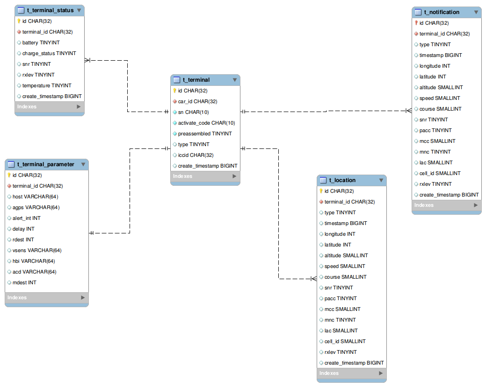
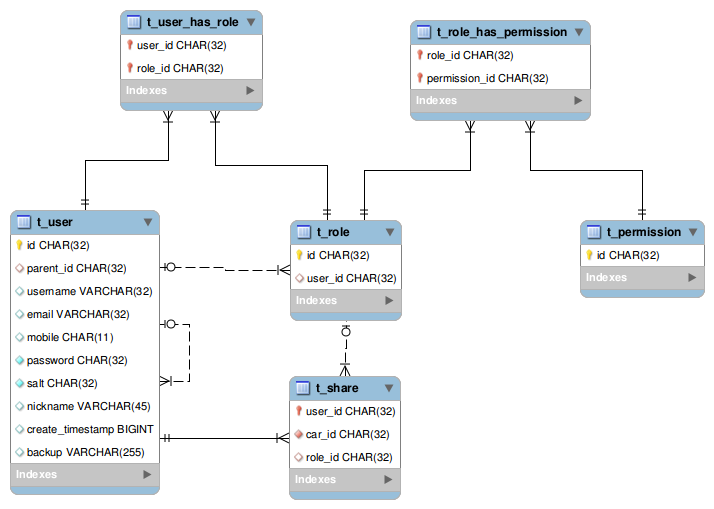

# 数据模型

## 目标

* 揉合各系统

* 满足当前需求的前提下，保证可扩展性

## 核心视图

###### 描述
* user可泛化为主账号、子账号
* group可泛化为车队、车辆

## 用户视图

###### 描述
* auth供可登录的不同类型账号复用
* user拥有自己的分组的同时也拥有其它账号共享的分组
* user可泛化为主账号与子账号
* user作为子账号时，如业务需要，则应该在业务处理中避免user拥有group

## 终端视图

###### 描述
* terminal作为locator的实现
* status保存terminal需经常更新的状态
* parameter保存需下发的terminal参数
* notification为终端上发的告警信息，与用户所看到的告警信息并非直接关系
* locations为终端上发的位置点信息

## 分组视图

###### 描述
* 分组分为车队与车辆

## 告警视图

###### 描述
* 需要知道现阶段所有告警类型，才能进行进一步设计
* user与event多对多关系，以便用户间可以独立操作各自的告警。

## 权限视图

###### 描述
* 主要覆盖3种场景：主账号的权限，子账号的权限，share时指定的权限
* 主账号可以创建属于自己的权限组，用于指定子账号的权限与指定share时的权限

## 统一平台模式

#### 目标

* 核心尽量小，功能内聚

#### WebAPI
　　由统一平台提供一套核心API，核心服务提供http接口，并可配置。扩展的方式为在核心服务外封装一层服务，以实现扩展的部分功能。

#### [Gateway](./doc/gateway.md)
　　由统一平台的Gateway处理较重要的部分，其余部分交由插件完成。