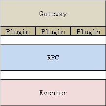

## 终端与平台交互主要流程
1. 非报文包过滤
1. 报文序列化与反序列化
1. 报文缓存\重复过滤
1. 报文处理
	* 会话管理
	* 持久化(入库)
	* 第三方服务
		* 基站定位
		* 逆地址
		* 偏转
	* PUSH推送
	* SMS、Email

## 主要报文类型
* 登录报文
* 心跳报文
* 状态更新报文
* 获取参数报文
* 位置报文
* 告警报文

## 分离核心部分

1. 非报文包过滤，主要指一些服务器的健康检查包的过滤，可以使用配置的方式达到复用效果。
2. 报文序列化与反序列化，要依靠新的终端协议才能确定。
3. 报文缓存与重复过滤，需基于终端标识与报文流水号，保证终端的报文不被重复处理。是否可以由以前使用ICCID标识终端改为使用SN标识终端？

以上3点的报文处理，变化较少，易于复用。

而第4点的报文处理，由于涉及业务逻辑，统一的部分越多，自由度就越少。

## 策略

* 其中Gateway完成前3点，对报文做预处理
* Plugin负责处理各类型报文的统一部分
* Gateway处理完后（或再经Plugin处理完）的报文，通过RPC方式调用Eventer
* Eventer作出更仔细的处理后，返回数据
* 对每个报文的处理，前期可以尽量开发Plugin集中处理共同部分，然后由Eventer进行妥协扩展处理
* 如果Plugin + Eventer的形式不能解决业务问题，则考虑去除Plugin，由Eventer全权处理。